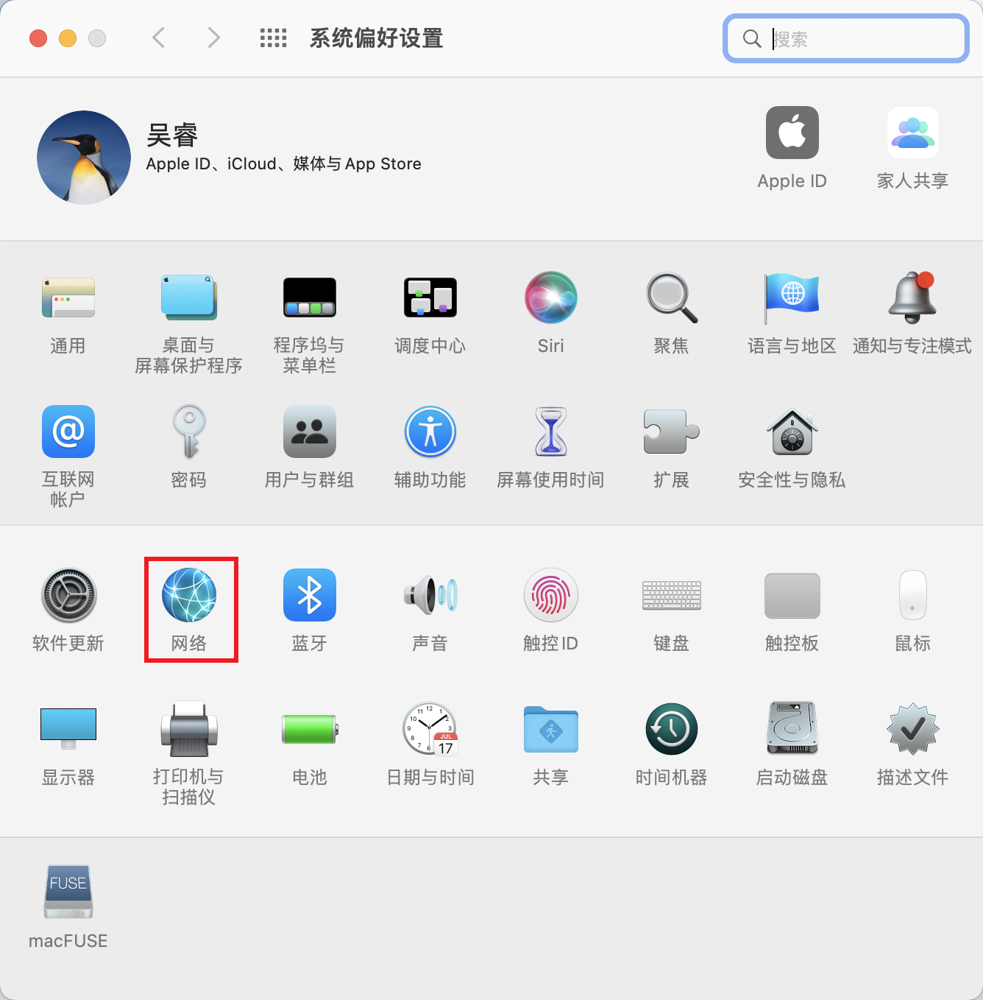

# 开发环境

:::warning
该部分需要完善。
:::

设置开发环境就好比砍柴前的磨刀，一个良好的开发环境能帮助你快速进入开发状态。

## 系统

请使用 Unix 系统作为开发的主力系统以获取更好的开发体验。

[macOS](https://www.apple.com/macos/) 是第一选择。如果你无力购买苹果官方的相关设备来使用 macOS，请使用 [Deepin](https://www.deepin.org/)。

::: details 考量

- Unix 系统大部分都是免费使用，无需担心侵权问题。
- Unix 系统体验比 WSL 更佳。
- Unix 系统更为稳定。
- Unix 处理能力更好。
- Unix 开发者资料更多。
- 生产环境大多使用 Unix 环境。

:::

::: warning 不推荐

- 本规范不推荐使用 Windows，且本章节将以 Unix 系统为重点展开。这是因为使用 Windows 很难得到舒适的开发体验，即使使用了 WSL 也是如此。
- 本规范不推荐使用黑苹果。这是因为黑苹果的体验远差于白苹果，且存在侵权问题。

:::

## DNS

请修改系统的 DNS 为 [阿里 DNS](http://alidns.com/)。

<el-tabs>
  <el-tab-pane label="macOS">
  





  </el-tab-pane>
  <el-tab-pane label="Deepin">TODO</el-tab-pane>
  <el-tab-pane label="Windows (不推荐)">TODO</el-tab-pane>
</el-tabs>

::: details 背后的考量
修改系统 DNS 可有效避免运营商劫持。

阿里 DNS 的解析表现比 [百度 DNS](https://dudns.baidu.com/)、[腾讯 DNS](https://www.dnspod.cn/Products/Public.DNS) 和 [114 DNS](https://www.114dns.com/) 更稳定。但如果你实测并非如此，你可以自行调整 DNS。
:::

## 浏览器

请安装 [Edge](https://www.microsoft.com/en-us/edge) 或 [Chrome](https://www.google.com/intl/en_us/chrome/) 作为主力开发浏览器。

::: details 背后的考量
调试什么浏览器需根据客户需求确定，但至少应在最新的 Edge 或 Chrome 浏览器测试通过。

国内常见的浏览器有 Edge、Chrome、Firefox、Safari、360 浏览器、360 极速浏览器、360 极速浏览器 X、QQ 浏览器、UC 浏览器、夸克浏览器等。
:::

::: tip 浏览器内核
可以使用 [浏览器内核检测工具](https://ie.icoa.cn/) 或 [ua-parser-js](https://github.com/faisalman/ua-parser-js) 检测内核。
:::

## 浏览器插件

请安装 [Lighthouse](https://github.com/GoogleChrome/lighthouse)、[Vue.js Devtools](https://devtools.vuejs.org/) 浏览器插件。

::: details 背后的考量
Lighthouse 能有效分析网页性能，帮助你做网页的性能优化。

由于司内使用 Vue 作为主要前端开发框架，所以需要安装 Vue.js Devtools 帮助调试。
:::

::: tip 处理网络问题
对于 Chrome，你可能不能访问 Chrome 应用商店而无法安装插件。请使用 [谷歌访问助手](/google-access-helper-master.zip)。

如果有条件，建议科学上网。
:::

## 包管理工具

请使用 [homebrew](https://brew.sh/) 作为包管理工具。

::: details 背后的考量

- homebrew 是使用率最高的包管理工具。
- homebrew 生态非常繁荣，大部分软件都可以通过 homebrew 直接安装，而无需关心路径配置、命令配置等问题。

:::

安装完毕后，需要链接额外的 cask。

```shell
brew tap homebrew/cask-drivers
brew tap homebrew/cask-fonts
brew tap homebrew/cask-versions
brew tap buo/cask-upgrade
brew tap mongodb/brew
```

如果需要更新，请使用如下命令。

```shell
brew cleanup --prune=all -q && brew upgrade && brew cu -ay && brew uninstall node@16 --ignore-dependencies -f && brew cleanup --prune=all -q
```

如果需要检查，请使用如下命令。你可以根据出现的提示修复错误。

```shell
brew doctor
```

::: warning Windows
对于 Windows 系统，请使用 [chocolatey](https://chocolatey.org/) 作为包管理工具。
:::

::: tip 处理网络问题
如果不设置镜像源就直接按照官网说明安装 homebrew ，容易出现网络问题，可手动设置 [homebrew 源](https://mirrors.ustc.edu.cn/help/brew.git.html)、[homebrew bottles 源](https://mirrors.ustc.edu.cn/help/homebrew-bottles.html)、[homebrew core 源](https://mirrors.ustc.edu.cn/help/homebrew-core.git.html)、[homebrew cask 源](https://mirrors.ustc.edu.cn/help/homebrew-cask.git.html)、[homebrew cask versions 源](https://mirrors.ustc.edu.cn/help/homebrew-cask-versions.git.html)。

镜像源同步可能落后。如果有条件，建议科学上网。
:::

## Git

可以使用 homebrew 直接安装 Git。

```shell
brew install git
```

请配置你的账号和邮箱。

```shell
git config --global user.name "your_name_example"
git config --global user.email "your_email@example.com"
```

请取消自动转换 CRLF。

```shell
git config --global core.autocrlf false
```

请设置默认分支名为 main。

```shell
git config --global init.defaultBranch main
```

Git 还需要密钥才能运作。请生成 ed25519 和 rsa 两套密钥。

```shell
ssh-keygen -t ed25519 -C "your_email@example.com"
ssh-keygen -t rsa -b 4096 -C "your_email@example.com"
```

::: details 背后的考量
取消自动转换 CRLF 有利于跨系统协作。

诸多 Git 服务商已经设置默认分支名为 main。

司内使用的 Azure DevOps 目前还只支持 rsa 密钥，尽管 rsa 安全性不如 ed25519，但仍然需要生成两套密钥。
:::

::: tip 安全性
建议输入你自己的 passphrase 并牢记于心，而不是留空回车。这样有利于提高密钥的安全性。
:::

::: tip 使用密钥
在本地，你需要添加私钥。

```shell
ssh-add ~/.ssh/id_ed25519
ssh-add ~/.ssh/id_rsa
```

在服务商，你需要添加公钥。在本地获取到公钥内容后，打开服务商页面，粘贴公钥内容并保存。

```shell
cat ~/.ssh/id_ed25519.pub # 获取 es25519 公钥内容
cat ~/.ssh/id_rsa.pub # 获取 rsa 公钥内容
```


:::

## VSCode

请使用 [VSCode](https://code.visualstudio.com/) 作为开发的主力编辑器。

:::details 背后的考量

- VSCode 是 Web 开发者使用率最高的编辑器 / IDE。
- VSCode 开源、免费，无需担心侵权问题。
- VSCode 生态更繁荣，可扩展性强。
- VSCode 可以运行在不同系统乃至浏览器上，提供非常相近的开发体验。

:::

可以使用 homebrew 直接安装 VSCode。

```shell
brew install --cask visual-studio-code
```

安装完毕后，请自行安装以下插件。

- [any-rule](https://marketplace.visualstudio.com/items?itemName=russell.any-rule) - 提供常用正则
- [Code Spell Checker](https://marketplace.visualstudio.com/items?itemName=streetsidesoftware.code-spell-checker) - 提供拼写检查
- [Commit Message Editor](https://marketplace.visualstudio.com/items?itemName=adam-bender.commit-message-editor) - 辅助书写提交信息
- [Dotenv Official + Vaule](https://marketplace.visualstudio.com/items?itemName=dotenv.dotenv-vscode) - 提供 .env 相关文件的高亮、自动补全等
- [EditorConfig for VSCode](https://marketplace.visualstudio.com/items?itemName=EditorConfig.EditorConfig) - 提供 .editorconfig 支持
- [ESLint](https://marketplace.visualstudio.com/items?itemName=dbaeumer.vscode-eslint) - 提供 ESLint 支持
- [Git Graph](https://marketplace.visualstudio.com/items?itemName=mhutchie.git-graph) - 提供 Git 图表和操作支持
- [Git History](https://marketplace.visualstudio.com/items?itemName=donjayamanne.githistory) - 查看 Git 日志和文件历史，比较分支或提交
- [GitLens](https://marketplace.visualstudio.com/items?itemName=eamodio.gitlens) - 提供 Git 支持
- [Goto definition alias](https://marketplace.visualstudio.com/items?itemName=antfu.goto-alias) - 提供根据类型别名直接跳转到实际引用的能力
- [i18n Ally](https://marketplace.visualstudio.com/items?itemName=Lokalise.i18n-ally) - 提供国际化支持
- [Image preview](https://marketplace.visualstudio.com/items?itemName=kisstkondoros.vscode-gutter-preview) - 提供图片文件预览
- [Markdown All in One](https://marketplace.visualstudio.com/items?itemName=yzhang.markdown-all-in-one) - 提供 markdown 支持
- [Markdown Preview Enhanced](https://marketplace.visualstudio.com/items?itemName=shd101wyy.markdown-preview-enhanced) - 增强 markdown 预览
- [markdownlint](https://marketplace.visualstudio.com/items?itemName=DavidAnson.vscode-markdownlint) - 提供 markdownlint 支持
- [Prettier](https://marketplace.visualstudio.com/items?itemName=esbenp.prettier-vscode) - 提供 Prettier 支持
- [React Style Helper](https://marketplace.visualstudio.com/items?itemName=iceworks-team.iceworks-style-helper) - 提供更好的 CSS / LESS / SASS / SCSS 支持
- [Sass](https://marketplace.visualstudio.com/items?itemName=Syler.sass-indented) - 提供 SASS / SCSS 支持
- [Stylelint](https://marketplace.visualstudio.com/items?itemName=stylelint.vscode-stylelint) - 提供 Stylelint 支持
- [SVG](https://marketplace.visualstudio.com/items?itemName=jock.svg) - 提供 SVG 支持
- [Tailwind CSS IntelliSense](https://marketplace.visualstudio.com/items?itemName=bradlc.vscode-tailwindcss) - 提供 TailwindCSS 支持
- [Todo Tree](https://marketplace.visualstudio.com/items?itemName=Gruntfuggly.todo-tree) - 提供特定的注释文本高亮支持
- [TSConfig Helper](https://marketplace.visualstudio.com/items?itemName=johnsoncodehk.vscode-tsconfig-helper) - 提供 tsconfig.json 额外特性支持
- [Volar](https://marketplace.visualstudio.com/items?itemName=Vue.volar) - 提供 Vue 支持
- [YAML](https://marketplace.visualstudio.com/items?itemName=redhat.vscode-yaml) - 提供 YAML 支持

VSCode 支持同步配置，登录后即可自动同步。

## Shell

建议切换默认 shell 到 zsh，并安装 [oh-my-zsh](https://ohmyz.sh/) 配合使用。另外建议安装 [zsh-syntax-highlighting](https://github.com/zsh-users/zsh-syntax-highlighting) 和 [zsh-autosuggestions](https://github.com/zsh-users/zsh-autosuggestions) 两个插件。

::: tip 默认 shell
Deepin 默认 shell 为 zsh，无需处理。

macOS 请执行如下命令。执行后可能需要重启才生效。

```shell
sudo chsh -s /bin/zsh
```

:::

::: tip 处理 oh-my-zsh 插件权限问题

如果 oh-my-zsh 两个插件安装失败，一般是因为权限不足。可通过修改权限处理该问题。

```shell
sudo chown -R $USER:$USER ~/.oh-my-zsh
# sudo chown -R 755 ~/.oh-my-zsh
sudo git clone https://github.com/zsh-users/zsh-syntax-highlighting ${ZSH_CUSTOM:-~/.oh-my-zsh/custom}/plugins/zsh-syntax-highlighting
sudo git clone https://github.com/zsh-users/zsh-autosuggestions ${ZSH_CUSTOM:-~/.oh-my-zsh/custom}/plugins/zsh-autosuggestions
```

:::

::: tip 修改 oh-my-zsh 默认主题以显示当前完整路径

使用 VSCode 打开默认主题的配置文件。

```shell
code ~/.oh-my-zsh/themes/robbyrussell.zsh-theme
```

修改文件内容如下并保存。保存后可能需要重启才生效。

```shell
PROMPT="%(?:%{$fg_bold[green]%}➜ :%{$fg_bold[red]%}➜ )"
PROMPT+=' %{$fg[cyan]%}[$PWD]%{$reset_color%} $(git_prompt_info)'

ZSH_THEME_GIT_PROMPT_PREFIX="%{$fg_bold[blue]%}git:(%{$fg[red]%}"
ZSH_THEME_GIT_PROMPT_SUFFIX="%{$reset_color%} "
ZSH_THEME_GIT_PROMPT_DIRTY="%{$fg[blue]%}) %{$fg[yellow]%}✗"
ZSH_THEME_GIT_PROMPT_CLEAN="%{$fg[blue]%})"

```

:::

::: warning Windows
对于 Windows 系统，建议使用 [Windows Terminal](https://apps.microsoft.com/store/detail/windows-terminal/9N0DX20HK701?hl=zh-cn&gl=cn) + Git Bash。Git Bash 在安装 Git 时应会一并安装。

另见 [定制参考 1](https://sspai.com/post/62167) 和 [定制参考 2](https://sspai.com/post/63814)。
:::

使用 VSCode 打开 zsh 的配置文件并启用 oh-my-zsh 的插件。

```shell
code ~/.zshrc
```

修改文件内相关内容如下。

```shell
plugins=(git vscode web-search z zsh-syntax-highlighting zsh-autosuggestions) # 启用 oh-my-zsh 插件

source $ZSH/oh-my-zsh.sh

...

export DEFAULT_USER="$(whoami)" # 显示使用者

# homebrew
export PATH=/usr/local/sbin:$PATH
```

保存并关闭后，执行命令应用改动。你可能需要重启 shell 才能感受到变化。

```shell
source ~/.zshrc
```

## Node.js 运行时管理工具

请使用 [nvm](https://github.com/nvm-sh/nvm) 作为 Node.js 运行时管理工具。

::: warning Windows
对于 Windows 系统，请使用 [nvm-windows](https://chocolatey.org/) 作为包管理工具。
:::

::: warning 安装
请参考链接里的说明安装运行时管理工具。

请不要使用包管理工具安装运行时管理工具，因为很可能会导致难以调试的错误。
:::

::: tip 处理网络问题
nvm 指引中使用 GitHub 链接来安装，容易出现网络问题，可查看 [GitHub Proxy](https://ghproxy.com/)、[GitHub 访问加速](https://zhuanlan.zhihu.com/p/75994966)、[3 种加速访问 GitHub 的方法](https://segmentfault.com/a/1190000041466088) 等自行调整。

如果有条件，建议科学上网。
:::

## Node.js 运行时

请使用 Node.js 运行时管理工具安装 Node.js 运行时。

一般情况下，使用最新的 Node.js LTS 版本并每月更新一次即可。你可以在 [这里](https://nodejs.org/) 核对版本。

```shell
nvm install --lts
nvm alias default node
```

::: warning Windows
nvm-windows 和 nvm 命令不同。你需要明确指定安装的版本，如 `nvm install 18.12.0`。你也无法指定默认的 Node.js 版本。
:::

::: tip 处理网络问题
nvm 和 nvm-windows 默认使用官方的 Node.js 链接下载并安装 Node.js，容易出现网络问题，可以设置镜像源加快下载速度。

对于 nvm，可参考以下做法。你也可以在 zsh 配置文件中增加 `export NVM_NODEJS_ORG_MIRROR=https://npmmirror.com/mirrors/node/` 并保存、应用改动，这样就会默认使用镜像源下载。

```shell
export NVM_NODEJS_ORG_MIRROR=https://npmmirror.com/mirrors/node/
nvm install --lts
nvm alias default node
```

对于 nvm-windows，可参考以下做法。

```shell
nvm node_mirror https://npmmirror.com/mirrors/node/
nvm npm_mirror https://npmmirror.com/mirrors/npm/
nvm install 18.12.0
```

如果有条件，建议科学上网。
:::

::: tip 修改 nvm 的配置
建议打开 zsh 配置文件，修改 nvm 相关内容如下并保存、应用改动。

```shell
# nvm
export NVM_DIR="$HOME/.nvm"
[ -s "$NVM_DIR/nvm.sh" ] && \. "$NVM_DIR/nvm.sh"  # This loads nvm
[ -s "$NVM_DIR/bash_completion" ] && \. "$NVM_DIR/bash_completion"  # This loads nvm bash_completion
# export NVM_NODEJS_ORG_MIRROR=https://npmmirror.com/mirrors/node/ # 如果你需要使用镜像源，可以取消该行注释
```

:::

## NPM 全局包

请使用 npm 安装全局包。

```shell
npm uninstall --location=global corepack
npm install --location=global --registry=https://registry.npmmirror.com @nestjs/cli
npm install --location=global --registry=https://registry.npmmirror.com @swc/cli
npm install --location=global --registry=https://registry.npmmirror.com @swc/core
npm install --location=global --registry=https://registry.npmmirror.com @swc/helpers
npm install --location=global --registry=https://registry.npmmirror.com @swc/wasm
npm install --location=global --registry=https://registry.npmmirror.com @types/node
npm install --location=global --registry=https://registry.npmmirror.com eslint
npm install --location=global --registry=https://registry.npmmirror.com live-server
npm install --location=global --registry=https://registry.npmmirror.com nodemon
npm install --location=global --registry=https://registry.npmmirror.com npm-check-updates
npm install --location=global --registry=https://registry.npmmirror.com pm2
npm install --location=global --registry=https://registry.npmmirror.com pnpm
npm install --location=global --registry=https://registry.npmmirror.com prettier
npm install --location=global --registry=https://registry.npmmirror.com release-it
npm install --location=global --registry=https://registry.npmmirror.com sort-package-json
npm install --location=global --registry=https://registry.npmmirror.com stylelint
npm install --location=global --registry=https://registry.npmmirror.com ts-node
npm install --location=global --registry=https://registry.npmmirror.com tsx
npm install --location=global --registry=https://registry.npmmirror.com typescript
npm install --location=global --registry=https://registry.npmmirror.com yarn
```

全局包对应的作用可自行到 [npmjs.com](https://npmjs.com) 搜索查看。

如果需要更新，请使用如下命令。

```shell
npm update --location=global --registry=https://registry.npmmirror.com
```

## Android Studio

有些时候我们需要使用 Android Studio 来开发调试 Android 应用。可以使用 homebrew 直接安装 Android Studio。另外还需要安装 openjdk 供其使用。

```shell
brew install openjdk
brew install --cask android-studio
```

你还需要修改 zsh 的配置文件，增加 android 和 openjdk 相关配置。最后不要忘了保存并应用改动。

```shell
# android
export ANDROID_HOME=$HOME/Library/Android/sdk
export PATH=$PATH:$ANDROID_HOME/emulator
export PATH=$PATH:$ANDROID_HOME/tools
export PATH=$PATH:$ANDROID_HOME/tools/bin
export PATH=$PATH:$ANDROID_HOME/platform-tools

# openjdk
export PATH=/usr/local/opt/openjdk/bin:$PATH
```

## HBuilderX

司内使用 uni-app 开发小程序和移动应用。开发、发布移动应用时，必须使用 HBuilderX。请前往 [官网](https://www.dcloud.io/hbuilderx.html) 下载正式版。

下载完毕后，请自行添加以下插件，并安装所有核心插件。

- [dart-sass 编译](https://ext.dcloud.net.cn/plugin?id=5701)
- [es6 编译](https://ext.dcloud.net.cn/plugin?id=2045)
- [HBuilderX uni-app 自动化测试](https://ext.dcloud.net.cn/plugin?id=5708)
- [scss/sass 编译](https://ext.dcloud.net.cn/plugin?id=2046)

## 参考

- [打造舒适高效的前端开发环境](http://fe.ssr-fc.com/)

<script setup>
import { ElTabs, ElTabPane } from 'element-plus';
import 'element-plus/es/components/tabs/style/css';
import 'element-plus/es/components/tab-pane/style/css';
</script>

<style>
:root {
  --el-color-primary: var(--vp-c-brand);
  --el-color-primary-light-3: var(--vp-c-brand-light);
  --el-color-primary-light-5: var(--vp-c-brand-lighter);
  --el-color-primary-dark-2: var(--vp-c-brand-dark);
}
</style>
